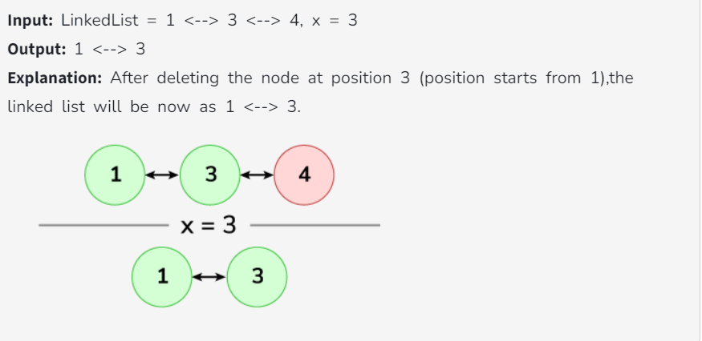

## Linkedlist Questions :

### 1 . [Array to Linked List](https://www.geeksforgeeks.org/problems/introduction-to-linked-list/1?utm_source=youtube&utm_medium=collab_striver_ytdescription&utm_campaign=introduction-to-linked-list) (Easy)

#### Given an array of integer arr. Your task is to construct the linked list from arr & return the head of the linked list.


### Code :

```java
class Solution {
    static Node constructLL(int arr[]) {

        Node Head = new Node(arr[0]);
        Node mover = Head;
        if(arr.length ==0){
            return null;
        }
        for(int i=1; i<arr.length; i++){
            Node temp = new Node(arr[i]);
            mover.next = temp;
            mover = temp;
            mover.next = null;
        }
        return Head;
    }
}
```

### 2 . [Linked List Insertion At End](https://www.geeksforgeeks.org/problems/linked-list-insertion-1587115620/0?utm_source=youtube&utm_medium=collab_striver_ytdescription&utm_campaign=linked-list-insertion) (Easy)

#### Given the head of a Singly Linked List and a value x, insert that value x at the end of the LinkedList and return the modified Linked List.

#### Examples :


### Code :

```java
class Solution {
    Node insertAtEnd(Node head, int x) {
        Node mover = head;

        if(head == null){
            return new Node(x);
        }
        while(mover.next != null){
            mover =mover.next;
        }

        if(mover.next == null){
            Node last = new Node(x);
            mover.next = last;
            mover = last;
        }

        return head;
    }
}

```

### 3 . [Delete Node in a Linked List](https://leetcode.com/problems/delete-node-in-a-linked-list/description/) (Medium)

#### There is a singly-linked list head and we want to delete a node node in it.

#### You are given the node to be deleted node. You will not be given access to the first node of head.


### Code :

```java
class Solution {
    public void deleteNode(ListNode node) {
        node.val = node.next.val;
        node.next = node.next.next;
    }
}
```

### 4 . [Count Linked List Nodes](https://www.geeksforgeeks.org/problems/count-nodes-of-linked-list/0?utm_source=youtube&utm_medium=collab_striver_ytdescription&utm_campaign=count-nodes-of-linked-list) (Easy)

#### Given a singly linked list. The task is to find the length of the linked list, where length is defined as the number of nodes in the linked list.


### Code :

```java
class Solution {
    public int getCount(Node head) {
        int cnt = 0;
        Node temp = head;
        while(temp != null){
            cnt++;
            temp = temp.next;
        }

        return cnt;
    }
}
```

### 5 . [Search in Linked List](https://www.geeksforgeeks.org/problems/search-in-linked-list-1664434326/1?utm_source=youtube&utm_medium=collab_striver_ytdescription&utm_campaign=search-in-linked-list-1664434326) (Easy)

#### Given a linked list of n nodes and a key , the task is to check if the key is present in the linked list or not.


### Code :

```java
class Solution {
    static boolean searchKey(int n, Node head, int key) {
        Node temp = head;
        while(n > 0){
            if(temp.data == key){
                return true;
            }
            temp = temp.next;
            n--;
        }
        return false;
    }
}
```

### 6 . [Introduction to Doubly Linked List](https://www.geeksforgeeks.org/problems/introduction-to-doubly-linked-list/1?utm_source=youtube&utm_medium=collab_striver_ytdescription&utm_campaign=introduction-to-doubly-linked-list) (Easy)

#### Geek is learning data structures and is familiar with linked lists, but he's curious about how to access the previous element in a linked list in the same way that we access the next element. His teacher explains doubly linked lists to him

#### Given an integer array arr of size n. Construct the doubly linked list from arr and return the head of it.


### Code :

```java
class Solution {
    Node constructDLL(int arr[]) {

        Node head = new Node(arr[0]);
        head.prev = null;
        Node temp = head;

        for(int i=1; i<arr.length; i++){
            Node newNode = new Node(arr[i]);
            temp.next = newNode;
            newNode.prev = temp;
            temp = newNode;
        }

        return head;
    }
}

```

### 7 . [Doubly linked list Insertion at given position](https://www.geeksforgeeks.org/problems/insert-a-node-in-doubly-linked-list/1?utm_source=youtube&utm_medium=collab_striver_ytdescription&utm_campaign=insert-a-node-in-doubly-linked-list) (Easy)

#### Given a doubly-linked list, a position p, and an integer x. The task is to add a new node with value x at the position just after pth node in the doubly linked list.


### Code :

```java
class GfG{
    void addNode(Node head_ref, int pos, int data){
        Node temp = head_ref;
        while(pos > 0){
            temp = temp.next;
            pos--;
        }
        Node newNode = new Node(data);
        newNode.next = temp.next;
        if(temp.next != null){
            temp.next.prev = newNode;
        }
        temp.next = newNode;
        newNode.prev = temp;
	}
}
```

### 8 . [Delete node in Doubly Linked List](https://www.geeksforgeeks.org/problems/delete-node-in-doubly-linked-list/1?utm_source=youtube&utm_medium=collab_striver_ytdescription&utm_campaign=delete-node-in-doubly-linked-list) (Easy)

#### Given a Doubly Linked list and a position. The task is to delete a node from a given position (position starts from 1) in a doubly linked list and return the head of the doubly Linked list.



### Code :

```java
class Solution {
    public Node deleteNode(Node head, int x) {
       if(head == null){
           return head;
       }
       if(x == 1){
           return head.next;
       }

       Node temp = head;
       while(x > 1){
           temp = temp.next;
           x--;
       }

       Node previ = temp.prev;
       previ.next = temp.next;
       if(temp.next != null){
           temp.next.prev = previ;
       }

       return head;
    }
}
```

### 9 . [Reverse a Doubly Linked List](https://www.geeksforgeeks.org/problems/reverse-a-doubly-linked-list/1?utm_source=youtube&utm_medium=collab_striver_ytdescription&utm_campaign=reverse-a-doubly-linked-list) (Easy)

Given a doubly linked list. Your task is to reverse the doubly linked list and return its head.


### Code :

#### Brute :

```java
class Solution {
    // TC : O(2n)
    // SC : O(n)
    public DLLNode reverseDLL(DLLNode head) {
        DLLNode temp = head;
        Stack<Integer> val = new Stack<>();
        while(temp != null){
            val.push(temp.data);
            temp = temp.next;
        }

        temp = head;
        while(temp != null){
            temp.data = val.pop();
            temp = temp.next;
        }
        return head;
    }
}
```

#### Optimal :

```java
class Solution {
    // TC : O(n)
    // SC : O(1)
    public DLLNode reverseDLL(DLLNode head) {
        if(head == null || head.next == null){
            return head;
        }

        DLLNode current  = head;
        DLLNode last = null;

        while(current != null){
            last = current.prev;
            current.prev = current.next;
            current.next = last;
            current = current.prev;
        }
        head = last.prev;
        return head;
    }
}
```

### 10 . [Middle of the Linked List](https://leetcode.com/problems/middle-of-the-linked-list/description/) (Easy)

Given the head of a singly linked list, return the middle node of the linked list.
If there are two middle nodes, return the second middle node.


### Code :

```java
class Solution {
    public ListNode middleNode(ListNode head) {
        ListNode slow = head;
        ListNode fast = head;

        while(fast != null && fast.next != null){
            slow = slow.next;
            fast = fast.next.next;
        }

        return slow;
    }
}
```

### 12 . [Reverse Linked List](https://leetcode.com/problems/reverse-linked-list/description/) (Easy)

Given the head of a singly linked list, reverse the list, and return the reversed list.


### Code :

#### Brute :

```java
class Solution {
    // TC : O(2N)
    // SC : O(N)
    public ListNode reverseList(ListNode head) {
        if(head == null || head.next == null){
            return head;
        }
        Stack<Integer> data = new Stack<>();
        ListNode temp = head;

        while(temp != null){
            data.push(temp.val);
            temp = temp.next;
        }
        temp = head;

        while(temp != null){
            temp.val = data.pop();
            temp = temp.next;
        }

        return head;

    }
}
```

#### Optimized :

```java
class Solution {
    // TC : O(N)
    // SC : O(1)
    public ListNode reverseList(ListNode head) {
        if(head == null || head.next == null){
            return head;
        }
        ListNode prev = null;
        ListNode curr = head;
        ListNode next = null;

        while(curr != null){
            next = curr.next;
            curr.next = prev;
            prev = curr;
            curr = next;
        }
        return prev;
    }
}
```

### 13 . [ Linked List Cycle](https://leetcode.com/problems/linked-list-cycle/description/) (Easy)

Given head, the head of a linked list, determine if the linked list has a cycle in it


### Code :

```java
public class Solution {
    public boolean hasCycle(ListNode head) {
       ListNode slow = head;
       ListNode fast = head;

       while(fast != null && fast.next != null){
            slow = slow.next;
            fast = fast.next.next;

            if(slow == fast){
                return true;
            }
        }
        return false;
    }
}
```

### 14 . [Linked List Cycle II](https://leetcode.com/problems/linked-list-cycle-ii/description/) (Medium)

#### Given the head of a linked list, return the node where the cycle begins. If there is no cycle, return null.

There is a cycle in a linked list if there is some node in the list that can be reached again by continuously following the next pointer. Internally, pos is used to denote the index of the node that tail's next pointer is connected to (0-indexed). It is -1 if there is no cycle. Note that pos is not passed as a parameter.

Do not modify the linked list.


### Code :

```java
public class Solution {
    public ListNode detectCycle(ListNode head) {
        ListNode fast = head;
        ListNode slow = head;

        while(fast != null && fast.next != null){
            slow = slow.next;
            fast = fast.next.next;
            if(fast == slow){
                slow = head;
                while(slow != fast){
                    slow = slow.next;
                    fast = fast.next;
                }
                return slow;
            }
        }
        return null;
    }
}
```

### 15 . [Length of Loop in Linked Lis](https://www.naukri.com/code360/problems/find-length-of-loop_8160455?utm_source=youtube&utm_medium=affiliate&utm_campaign=Codestudio_Linkedlistseries&leftPanelTabValue=PROBLEM) (Easy)

Given the head of a linked list, determine the length of a loop present in the linked list; if not present, return 0.


### Code :

```java
public class Solution
{
    public static int lengthOfLoop(Node head) {
        if(head == null || head.next == null){
            return 0;
        }
        Node slow  = head;
        Node fast = head;
        int cnt = 0;
        while(fast != null && fast.next != null){
            slow = slow.next;
            fast = fast.next.next;

            if(slow == fast){
                cnt++;
                slow = slow.next;
                while(slow != fast){
                    cnt++;
                    slow = slow.next;
                }
                return cnt;
            }
        }
        return 0;
    }
}
```

### 16 . []()
