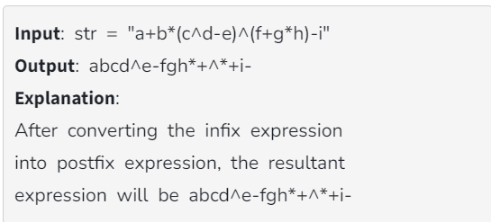
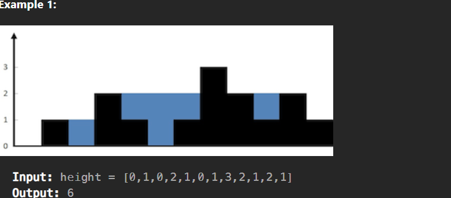

# Stacks & Queues Questions :

### 1 . [Implement stack using array](https://www.geeksforgeeks.org/problems/implement-stack-using-array/1?utm_source=youtube&utm_medium=collab_striver_ytdescription&utm_campaign=implement-stack-using-array)

Explanation:

push(): Insert the element in the stack.

pop(): Remove and return the topmost element of the stack.

top(): Return the topmost element of the stack

size(): Return the number of remaining elements in the stack.

```java
class MyStack {
    private int[] arr;
    private int top;

    public MyStack() {
        arr = new int[1000];
        top = -1;
    }

    public void push(int x) {
        top++;
        arr[top] = x;
    }

    public int pop() {
        if(top == -1){
            return -1;
        }
       top--;
       return arr[top + 1];
    }
}
```

### 1 . [Implement Queue using array](https://www.geeksforgeeks.org/problems/implement-queue-using-array/1?utm_source=youtube&utm_medium=collab_striver_ytdescription&utm_campaign=implement-queue-using-array)

```java
class MyQueue {

    int front, rear;
	int arr[] = new int[100005];

    MyQueue()
	{
		front=0;
		rear=0;
	}

	void push(int x)
	{
	    arr[rear] = x;
	    rear++;
	}

	int pop()
	{
		if(rear == front ){
		    return -1;
		}

		int popElement = arr[front];
		front++;
		return popElement;
	}
}
```

### 3 . [Implement Stack using Linked List](https://www.geeksforgeeks.org/problems/implement-stack-using-linked-list/1?utm_source=youtube&utm_medium=collab_striver_ytdescription&utm_campaign=implement-stack-using-linked-list)

```java
class MyStack {
    // class StackNode {
    //     int data;
    //     StackNode next;
    //     StackNode(int a) {
    //         data = a;
    //         next = null;
    //     }
    // }
    StackNode top;

    // Function to push an integer into the stack.
    void push(int a) {
        StackNode newNode = new StackNode(a);
        newNode.next = top;
        top = newNode;
    }

    // Function to remove an item from top of the stack.
    int pop() {
        if(top == null){
            return -1;
        }
        StackNode temp = top;
        top = top.next;
        temp.next = null;
        return temp.data;
    }
}

class stack {
  private class stackNode {
    int data;
    stackNode next;
    stackNode(int d) {
      data = d;
      next = null;
    }
  }
  stackNode top;
  int size;
  stack() {
    this.top = null;
    this.size = 0;
  }
  public void stackPush(int x) {
    stackNode element = new stackNode(x);
    element.next = top;
    top = element;
    System.out.println("Element pushed");
    size++;
  }
  public int stackPop() {
    if (top == null) return -1;
    int topData = top.data;
    stackNode temp = top;
    top = top.next;
    return topData;
  }
  public int stackSize() {
    return size;
  }
  public boolean stackIsEmpty() {
    return top == null;
  }
```

### 4 . [Implement Queue using Linked List](https://www.geeksforgeeks.org/problems/implement-queue-using-linked-list/1?utm_source=youtube&utm_medium=collab_striver_ytdescription&utm_campaign=implement-queue-using-linked-list)

```java
class MyQueue
{
    QueueNode front, rear;

    //Function to push an element into the queue.
	void push(int a)
	{
        if(front == null){
            QueueNode newNode = new QueueNode(a);
            newNode.next = null;
            front = newNode;
            rear = newNode;
        }else{
            QueueNode newNode = new QueueNode(a);
            rear.next = newNode;
            rear = newNode;
        }
	}

    //Function to pop front element from the queue.
	int pop()
	{
	    if(front == null ){
	        return -1;
	    }
        QueueNode temp = front;
        front = front.next;
        temp.next = null;
        return temp.data;
	}
}

import java.util.*;

class QueueNode
{
    int val;
    QueueNode next;
    QueueNode(int data)
    {
       val = data;
       next = null;
    }
}


class Queue
{
    QueueNode Front = null, Rear = null;
    int size = 0;

boolean Empty()
{
    return Front == null;
}
int Peek()
{
    if(Empty())
     {  System.out.println("Queue is Empty");
        return -1;
     }
    else
      return Front.val;
}
void Enqueue(int value)
{
    QueueNode Temp;
    Temp = new QueueNode(value);
    if (Temp == null)  //When heap exhausted
        System.out.println("Queue is Full");
    else
    {
        if (Front == null)
        {
            Front = Temp;
            Rear = Temp;
        }
        else
        {
            Rear.next = Temp;
            Rear = Temp;
        }
        System.out.println(value+" Inserted into Queue ");
        size++;
    }
}
void Dequeue()
{
    if (Front == null)
        System.out.println("Queue is Empty");
    else
    {
        System.out.println(Front.val+" Removed From Queue");
        QueueNode Temp = Front;
        Front = Front.next;
        size--;
    }
}
```

### 5 . [Implement Stack using Queues](https://leetcode.com/problems/implement-stack-using-queues/description/)

```java
class MyStack {
    Queue<Integer> q;
    public MyStack() {
        q = new LinkedList<>();
    }

    public void push(int x) {
        q.add(x);
        for(int i=1; i< q.size(); i++){
            q.add(q.remove());
        }
    }

    public int pop() {
       return q.remove();
    }

    public int top() {
        return q.peek();
    }

    public boolean empty() {
       return q.isEmpty();
    }
}
```

### 6 . [Implement Queue using Stacks](https://leetcode.com/problems/implement-queue-using-stacks/description/)

```java
class MyQueue {

    Stack<Integer> input = new Stack<>();
    Stack<Integer> output = new Stack<>();

    public MyQueue() {

    }

    public void push(int x) {
        input.push(x);
    }

    public int pop() {
        if(output.empty()){
            while(input.empty() == false){
               output.push(input.pop());
            }
            return output.pop();
        }
        return output.pop();
    }

    public int peek() {
        if (output.empty())
            while (input.empty() == false) {
                output.push( input.pop());
            }
        return output.peek();
    }

    public boolean empty() {
        if(input.isEmpty() && output.isEmpty()){
            return true;
        }
        return false;
    }
    int size() {
        return (output.size() + input.size());
    }
}
```

### 7 . [Valid Parentheses](https://leetcode.com/problems/valid-parentheses/description/)

Given a string s containing just the characters '(', ')', '{', '}', '[' and ']', determine if the input string is valid.

An input string is valid if:

Open brackets must be closed by the same type of brackets.
Open brackets must be closed in the correct order.
Every close bracket has a corresponding open bracket of the same type.

Example 1:

Input: s = "()"

Output: true

```java
class Solution {
    // TC : O(n)
    // SC : O(n)
    public boolean isValid(String s) {
        Stack<Character> st = new Stack<Character>();
        for(char it : s.toCharArray()){
            if(it == '(' || it =='[' || it == '{'){
                st.push(it);
            }
            else{
                if(st.isEmpty()){return false;}
                char ch = st.pop();
                if((it == ')' && ch =='(') || (it == ']' && ch =='[') || (it == '}' && ch =='{')){
                    continue;
                }
                else {
                    return false;
                }
            }
        }
        return st.isEmpty();
    }
}
```

### 8 . [Min Stack](https://leetcode.com/problems/min-stack/description/)

Design a stack that supports push, pop, top, and retrieving the minimum element in constant time.

Implement the MinStack class:

MinStack() initializes the stack object.
void push(int val) pushes the element val onto the stack.
void pop() removes the element on the top of the stack.
int top() gets the top element of the stack.
int getMin() retrieves the minimum element in the stack.
You must implement a solution with O(1) time complexity for each function.

```java
// TC : O(1)
// SC : O(n)
class MinStack {

    Stack<Long> st = new Stack<Long>();
    Long min;

    public MinStack() {
        min = Long.MAX_VALUE;
    }

    public void push(int value) {
        Long val = Long.valueOf(value);
        if (st.isEmpty()) {
            min = val;
            st.push(val);
        } else {
            if (val < min) {
                st.push(2 * val - min);
                min = val;
            } else {
                st.push(val);
            }
        }
    }

    public void pop() {
        if (st.isEmpty()) {
            return;
        } else {
            Long val = st.pop();
            if (val < min) {
                min = 2 * min - val;
            }
        }

    }

    public int top() {
        Long val = st.peek();
        if (val < min) {
            return min.intValue();
        }
        return val.intValue();

    }

    public int getMin() {
        return min.intValue();

    }
}
```

## Prefix, Infix, PostFix Conversion Problems

### 9 . [Infix to Postfix](https://www.geeksforgeeks.org/problems/infix-to-postfix-1587115620/1?utm_source=youtube&utm_medium=collab_striver_ytdescription&utm_campaign=infix-to-postfix)



```java
class Solution {
    // TC : O(n)
    // SC : O(n)
    public static String infixToPostfix(String exp) {

        String ans = new String("");
        Stack<Character> st = new Stack<Character>();

        for(int i=0; i<exp.length(); ++i){

            char ch = exp.charAt(i);
            if(Character.isLetterOrDigit(ch)){
                ans += ch;;
            }

            else if(ch == '('){
                st.push(ch);

            }
            else if(ch == ')'){
                while(!st.isEmpty() && st.peek() != '('){
                    ans += st.pop();
                }
                st.pop();
            }
            else{
                while(!st.isEmpty() && Prec(ch) <= Prec(st.peek())){
                    ans += st.pop();
                }
                st.push(ch);
            }
        }

        while(!st.isEmpty()){
            ans += st.pop();
        }

        return ans;
    }
    static int Prec (char ch){
        switch(ch){
            case '+':
            case '-':
                return 1;
            case '*':
            case '/':
                return 2;
            case '^':
                return 3;
        }
        return -1;
    }
}
```

### 10 . [Trapping Rain Water](https://leetcode.com/problems/trapping-rain-water/description/)


Given n non-negative integers representing an elevation map where the width of each bar is 1, compute how much water it can trap after raining.


```java
class Solution {
    public int trap(int[] height) {
        // TC : O(n)
        // SC : O(1)
        int n = height.length;
        int left = 0 ;
        int  right = n-1;
        int maxLeft = 0 ;
        int  maxRight = 0;
        int res = 0;
        while(left <= right){
            if(height[left] <= height[right]){
                if(height[left] > maxLeft){
                    maxLeft = height[left];
                }else{
                    res += maxLeft - height[left];
                }
                left++;
            }
            else{
                if(height[right] > maxRight){
                    maxRight = height[right];
                }else{
                    res += maxRight - height[right];
                }
                right--;
            }
        }
        return res; 
    }
}
```